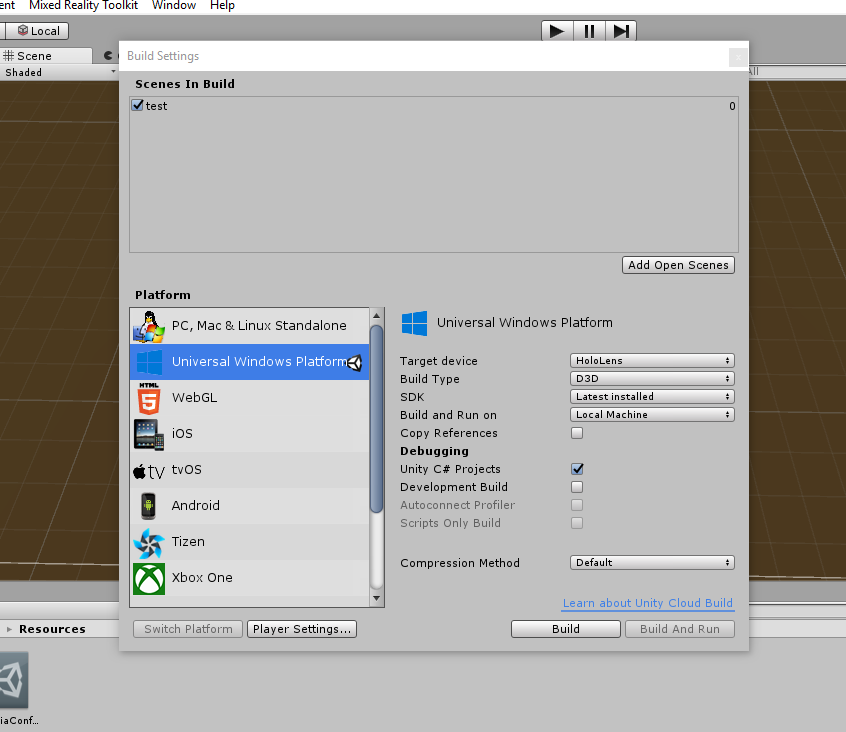

# RetailQonnections

This application will render information regarding retail products on the products themselves when using the Microsoft Hololens.
The application contains a Vuforia database that holds 3D representations of certain retail products that can be identified during runtime and send a selection depending on what item is identified to a sense enterprise server that will return valid information regarding that product.

Information retrieved regarding the product that will displayed on the product itself is 
- Product Name
- Amount of sales
- Affinity items(items that are usually purchased together with the item in focus)

## Requirements
- *Used in conjunction with  [Qlik Retail Node.js Server](https://github.com/ImmersiveAnalytics/QlikRetailNodeServer)*
- Must have Qlik Sense Server application running with Node.js app
- Must have Unity version 2017.2.2f1 (Unity 2017.3 contains a bug regarding UnityWebRequests for Hololens and UWP projects)
- Must have HoloToolkit 2017.2.1.3 added to Unity project
- Must have Visual Studio installed
- Must update Hololens to latest build

## To Run
- Download the Repo and open the solution in Unity.
- After opening project go to file dropdown in top left and select build settings and make sure to add the scene and then configure everything to look like this

